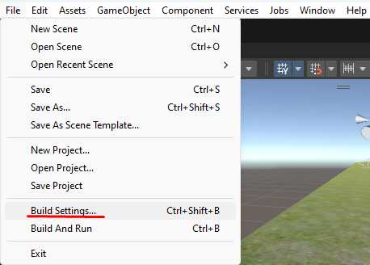
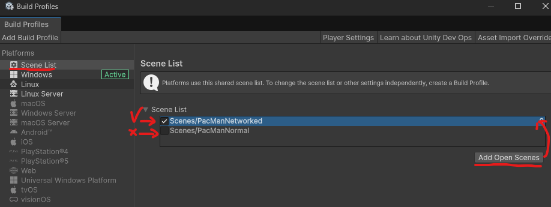
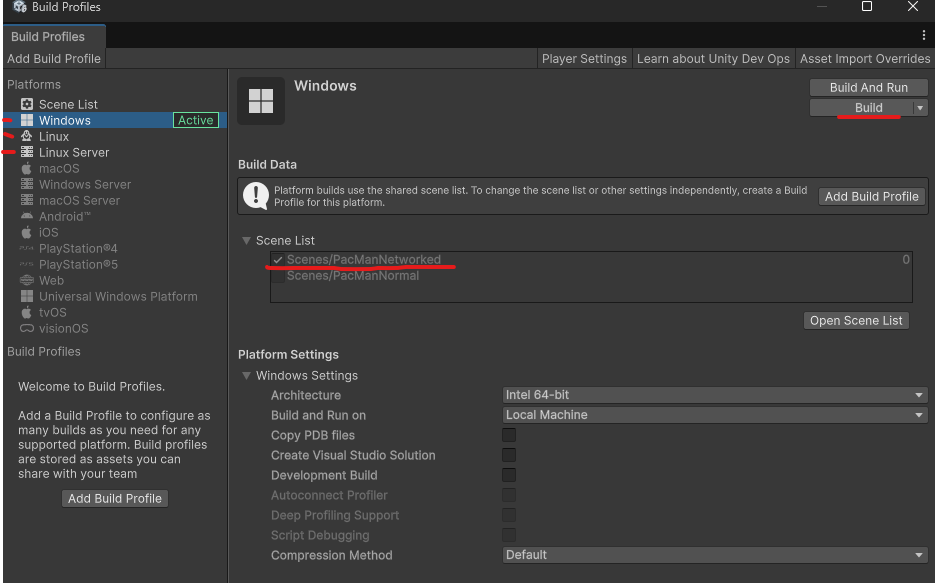
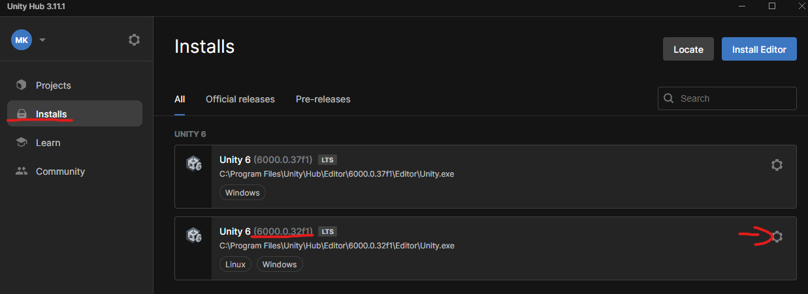
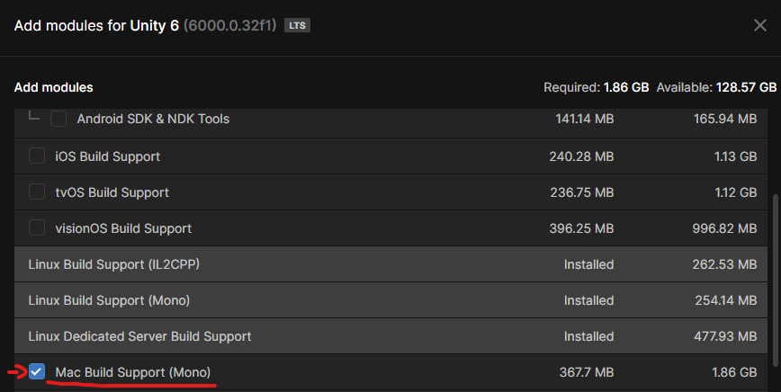

# PacMan Capture-The-Flag assignment

Inspired by UC Berkeley's Python environment: http://ai.berkeley.edu/contest.html

The PacMan environment is built using network Unity NetCode for GameObjects. 
If you wish to ignore most of that, you can build your AI code into the [PacManAI](Assets/Scripts/PacMan/PacManAI.cs) class, as in the previous assignments.
However, part of this assignment is competing against other teams.
For managing that, we have provided a networked version of the game as well.

We strongly suggest you test out your solutions in both **Host** and **Client/Server** mode **_AS EARLY AS POSSIBLE_**.
Otherwise you might run into unexpected issues during competitions.

It is possible to run the environment in one three ways:
- Normal Unity scene without networking (PacManNormal)
- Networked Host (PacManNetworked)
- Networked Client / Server (PacManNetworked)

## Host

In the host mode, both the clients and the server are run inside one instance of the environment.
This can be started by running the environment with "Play" and clicking on the "Host" button in the editor.

Or alternatively with the following command (assuming an executable named "PacManCTF"):
```
./PacManCTF -mode host
```

The host mode can be a convenient mode for testing changes quickly. 

You can change the code in the GameManager to launch into host mode directly. **Dont forget to change it back when its competition time!**

## Client / Server

In this mode, 3 instances of the application are necessary to run the game. Therefore, a built artifact is required to launch it in this manner.

Once you have the executable, you can either:
- Run it 3 times and use the GUI to start 1 server and 2 clients. The server should be started first.
- Alternatively using this command (assuming an executable named "PacManCTF"):
```
 ./PacManCTF -mode server & ./PacManCTF -mode client & ./PacManCTF -mode client
```
Delays in the Client/Server mode are larger than in host mode. It is suggested you test your algorithms out in both modes.
Note that the **final competitions will be in Client/Server mode**, to enable you to share executables and run games against other teams without seeing their code.

NB! Note that if the "-mode" parameter is not set, you have to manually specify it from the GUI after startup.
## Other command line options

It is possible to manually change the port of an executable 

```
 ./PacManCTF -port <number> -mode host
```

Or the map to be loaded during startup

```
 ./PacManCTF -map <name> 
```
Valid map names can be found in the map manager, as in previous assignments. A valid example would be
```
 ./PacManCTF -map pacmanA
``` 

# Building an executable



It is best to build a single scene into the executable at once, unless you know what you are doing and how to select scenes.



You can change the Target Platform in order to build versions that can be used by people on other plaforms.
In order for that to be available you have to add the corresponding modules to the version of the engine you are using (see below).



NB! When building for different platforms, do not open or launch any of the files!
Some filesystems will cause the files to become corrupted and not launchable on the target platform.

If for some reason some of the platforms are grayed out, you can add support for those as follows:




Do not forget to restart your editor after installing new support modules.

NB! On some platforms you might need to delete your old build artifacts if you wish to build an artifact into the same folder as a previous one to see any changes.

Once the executable is built, you can run it directly  as any other application and use the UI as in the editor or using the commands in the sections above.
## Debugging executables

I suggest reading the Unity [netcode for gameobjects](https://docs-multiplayer.unity3d.com/netcode/current/about) manual in general, if you wish to understand more about how this environment is built.

At the very least, I suggest looking at the information about [debugging.](https://docs-multiplayer.unity3d.com/netcode/current/tutorials/testing/techniques_and_tricks_for_debugging_multiplayer_games)

If you are working on Windows, I suggest you check out this [subsection about logfiles](https://docs-multiplayer.unity3d.com/netcode/current/tutorials/command-line-helper#test-on-windows) and if you are on Mac, [subsection about launching in general](https://docs-multiplayer.unity3d.com/netcode/current/tutorials/command-line-helper#test-on-macos).
